# Model ratingowy do predykcji defaultu kredytowego

Projekt na przedmiot Interpretowalność i Wyjaśnialność Uczenia Maszynowego

---

## Opis projektu

Celem projektu jest stworzenie modelu ratingowego do predykcji defaultu kredytowego na podstawie zbioru danych dotyczących klientów banku (firm). W ramach projektu stworzyliśmy dwa modele: model regresji logistycznej (interpretowalny) oraz model lasu losowego (black box). Zastosowaliśmy techniki kalibracji oraz metody wyjaśnialności, przede wszystkim SHAP, aby lepiej zrozumieć działanie modeli.

---

## Instalacja

### Opcja 1: Conda (zalecane)

```bash
# Utwórz środowisko z pliku environment.yml
conda env create -f environment.yml

# Aktywuj środowisko
conda activate xai_projekt
```

### Opcja 2: pip

```bash
# Zainstaluj zależności z requirements.txt
pip install -r requirements.txt
```

### Wymagania

- Python 3.11+
- Kluczowe biblioteki:
  - scikit-learn (modele ML)
  - optuna (tuning hiperparametrów)
  - shap (wyjaśnialność)
  - pandas, numpy (przetwarzanie danych)
  - matplotlib, seaborn (wizualizacje)

---

## Struktura repozytorium

```plaintext
XAI_Projekt-1/
│
├── data/                          # Dane wejściowe i przetworzone
│   ├── train.csv                  # Zbiór treningowy (po feature selection)
│   ├── test.csv                   # Zbiór testowy (po feature selection)
│   ├── zbiór_5.csv                # Oryginalny zbiór danych
│   └── zbiór_5_preprocessed.csv   # Zbiór po wstępnym preprocessingu
│
├── src/                           # Skrypty Python
│   ├── constants.py               # Stałe i konfiguracja projektu
│   ├── utils.py                   # Funkcje pomocnicze
│   ├── data_processing.py         # Pipeline'y preprocessingu danych
│   ├── manual_preprocessing.py    # Ręczny preprocessing zbioru
│   ├── split_data.py              # Podział danych train/test
│   ├── feature_selection.py       # Selekcja cech (RFE)
│   ├── baseline_models.py         # Trenowanie modeli bazowych
│   ├── lr_tuning.py               # Tuning regresji logistycznej
│   ├── rf_tuning.py               # Tuning lasu losowego
│   ├── evaluate_tuned_models.py   # Ewaluacja modeli po tuningu
│   ├── calibration.py             # Kalibracja modeli
│   ├── threshold_selection.py     # Dobór optymalnego progu
│   ├── confusion_matrices.py      # Generowanie macierzy pomyłek
│   └── shap_analysis.py           # Analiza SHAP
│
├── notebooks/                     # Jupyter notebooks
│   ├── eda.ipynb                  # Eksploracyjna analiza danych
│   ├── logistic_regression.ipynb  # Wstępne eksperymenty z regresją logistyczną
│   ├── random_forest.ipynb        # Wstępne eksperymenty z lasem losowym
│   └── calibration.ipynb          # Wstępne eksperymenty z kalibracją
│
├── models/                        # Zapisane modele
│   ├── *_full.pkl                 # Modele trenowane na pełnym zbiorze cech
│   ├── *_reduced.pkl              # Modele po feature selection
│   ├── tuned_*.pkl                # Modele po tuningu hiperparametrów
│   └── calibrated_*.pkl           # Modele skalibrowane
│
├── plots/                         # Wykresy i wizualizacje
│   ├── shap/                      # Wykresy SHAP
│   ├── confusion_matrices.png     # Macierze pomyłek
│   ├── *_calibration_comparison.png  # Porównanie metod kalibracji
│   └── *_reliability.png          # Diagramy reliability nieskalibrowanych modeli
│
├── slownik_zmiennych_opisy.csv    # Słownik zmiennych
├── main.py                        # Główny skrypt uruchomieniowy
└── README.md                      # Dokumentacja projektu
```

### Workflow projektu

1. **Preprocessing**: `manual_preprocessing.py` → `split_data.py`
2. **Feature Selection**: `feature_selection.py`
3. **Baseline Models**: `baseline_models.py`
4. **Hyperparameter Tuning**: `lr_tuning.py`, `rf_tuning.py` | Domyślnie pomijane w `main()`. Gotowe modele są zapisane w `/models`.
5. **Model Evaluation**: `evaluate_tuned_models.py`
6. **Calibration**: `calibration.py`
7. **Threshold Selection**: `threshold_selection.py`, `confusion_matrices.py`
8. **Explainability**: `shap_analysis.py`

---

## Uruchomienie

Po instalacji należy uruchomić skrypt `main.py`, który przeprowadzi cały proces od wczytania i przetwarzania danych, treningu modeli, kalibracji, aż po generowanie wizualizacji i wyjaśnień:

```bash
python main.py
```

Plik `constants.py` zawiera wszystkie stałe używane w projekcie i umożliwia ewentualne zmiany niektórych parametrów (takich jak rozmiar zbioru testowego, seed) przed wywołaniem skryptu `main.py`.

---

## Dane

Dane zawierają informacje o klientach banku, w tym zmienną celu `default`, która wskazuje, czy klient spłacił kredyt (0) czy nie (1). Zbiór ma 3000 obserwacji, 220 kolumn i jest niezbalansowany (około 6% obserwacji to przypadki defaultu):

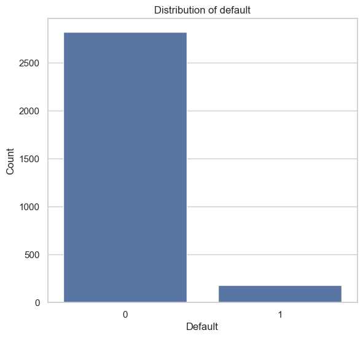

---

## EDA i preprocessing

Po sprawdzeniu rozkładu zmiennej celu, przeprowadziliśmy podstawową eksploracyjną analizę danych, w tym narysowanie macierzy korelacji, narysowanie kilku rozkładów cech.

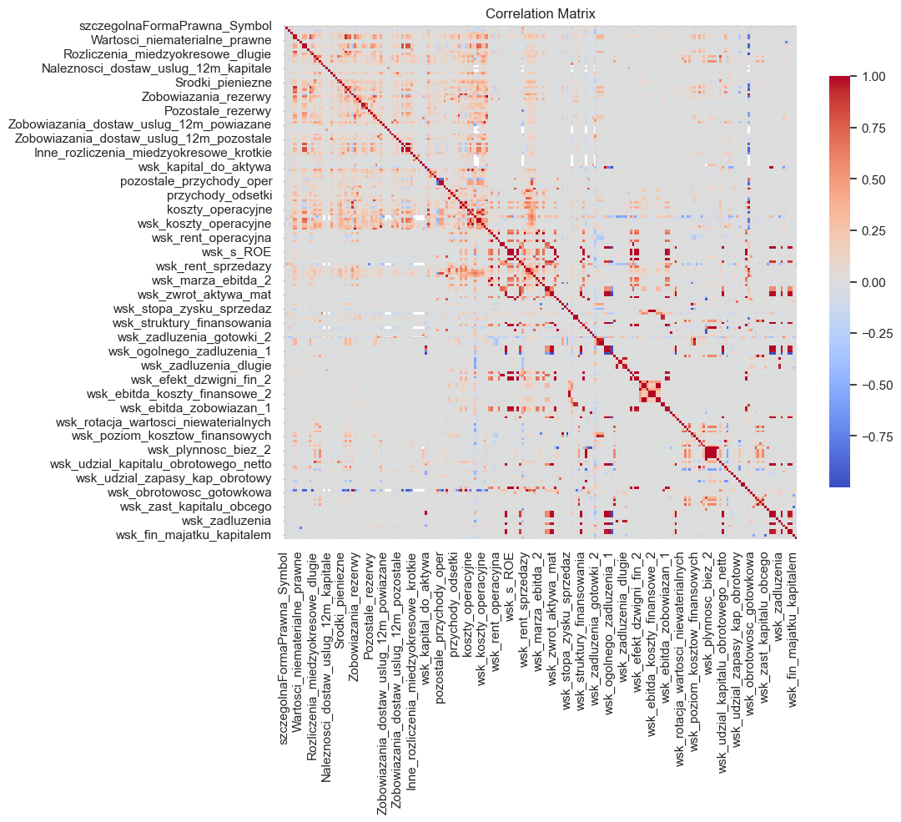

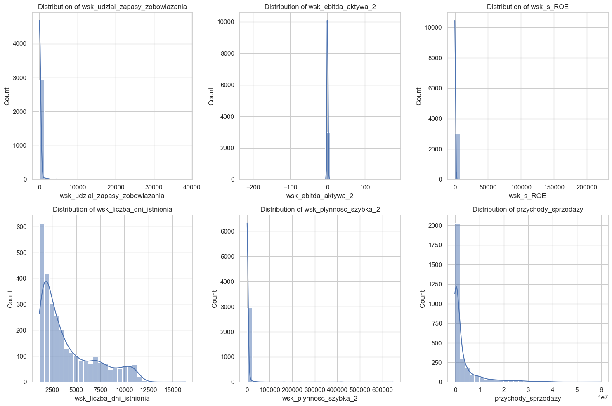

Dzięki analizie danych zidentyfikowaliśmy kilka problemów, w tym występujące w danych wartości inf, outliery oraz wartości 0, które w niektórych kolumnach prawdopodobnie oznaczały brak danych. Ostateczny preprocessing danych obejmował:

- Usunięcie kolumn z dużą liczbą identycznych wartości ( > 95% = `UNIQUE_VALUE_THRESHOLD`)
- Zastąpienie wartości 0 na NaN w kolumnach, gdzie 0 występowało często ( > 75% = `ZERO_TO_NAN_THRESHOLD`)
- Podział na zbiór treningowy i testowy (0.3 = `TEST_SIZE`)
- Selekcję zmiennych za pomocą RFE (z liczbą cech ustawioną na 100 = MAX_FEATURES)
- Pipeline, w zależności od modelu:
  - Dla regresji logistycznej:
    - Zastąpienie wartości inf maksymalną wartością w kolumnie
    - SimpleImputer medianą lub najczęściej występującą wartością
    - One-Hot Encoding dla zmiennych kategorycznych, z `drop='first'` oraz `add_indicator` optymalizowanym podczas optymalizacji hiperparametrów
    - Clippowanie outlierów (`alpha`% najmniejszych i największych, gdzie `alpha` potraktowaliśmy jako hiperparametr do optymalizacji)
    - Skalowanie cech za pomocą StandardScaler
    - Wyeliminowanie parami skorelowanych cech od `corr_threshold` (także traktowany jako hiperparametr do optymalizacji)
  - Dla lasu losowego:
    - Zastąpienie wartości inf maksymalną wartością w kolumnie
    - SimpleImputer medianą lub najczęściej występującą wartością
    - One-Hot Encoding dla zmiennych kategorycznych

---

## Tuning / optymalizacja hiperparametrów

Po przetworzeniu danych, przeprowadziliśmy strojenie hiperparametrów dla obu modeli za pomocą optymalizacji bayesowskiej z wykorzystaniem pakietu AutoML "Optuna". Jako metrykę optymalizacji wybraliśmy ROC AUC, a przeszukane zostało łącznie 400 różnych kombinacji hiperparametrów dla obu modeli. Optymalizacja została przeprowadzona z użyciem 5-krotnej stratyfikowanej walidacji krzyżowej, a wybrane zostały hiperparametry maksymalizujące średnią wartość ROC AUC.
Poniżej przedstawiamy optymalizowane hiperparametry razem z zakresami, krótkim opisem i najlepszymi znalezionymi podczas tuningu wartościami:

### Regresja logistyczna

| Hiperparametr | Zakres | Opis | Najlepsza wartość |
|---------------|--------|------|-------------------|
| `C` | [0.001, 1000] (log scale) | Odwrotność siły regularyzacji; mniejsze wartości oznaczają silniejszą regularyzację | 0.1245 |
| `class_weight` | ['balanced', None] | Wagi klas do radzenia sobie z niezbalansowanym zbiorem danych | None |
| `imputer_strategy` | ['mean', 'median'] | Strategia imputacji brakujących wartości | median |
| `add_indicator` | [True, False] | Czy dodać kolumny wskaźnikowe dla brakujących wartości | True |
| `alpha` | [0.0, 0.15] | Percentyl do clippowania outlierów (np. 0.05 oznacza usunięcie 5% skrajnych wartości z obu stron) | 0.1449 |
| `corr_threshold` | [0.5, 1.0] | Próg korelacji do usuwania parami skorelowanych cech | 0.9824 |

### Las losowy

| Hiperparametr | Zakres | Opis | Najlepsza wartość |
|---------------|--------|------|-------------------|
| `n_estimators` | [50, 300] (krok 5) | Liczba drzew w lesie | 85 |
| `max_depth` | [3, 12] | Maksymalna głębokość drzewa | 3 |
| `min_samples_leaf` | [1, 5] | Minimalna liczba próbek wymagana w liściu | 5 |
| `class_weight` | ['balanced', None] | Wagi klas do radzenia sobie z niezbalansowanym zbiorem danych | None |
| `imputer_strategy` | ['mean', 'median'] | Strategia imputacji brakujących wartości | median |
| `add_indicator` | [True, False] | Czy dodać kolumny wskaźnikowe dla brakujących wartości | True |

---

## Kalibracja

W ramach projektu naszym zadaniem było również przeprowadzenie kalibracji modeli, do średniej PD równej 4%. W tym celu testowaliśmy kalibrację izotoniczną oraz sigmoid dla obu modeli.

### Wyniki przed kalibracją

| Model | AUC | Recall | Brier Score | Log Loss | ECE |
|-------|-----|--------|-------------|----------|-----|
| Regresja logistyczna | 0.7303 | 0.0385 | 0.0511 | 0.2003 | 0.0218 |
| Las losowy | 0.7832 | 0.0000 | 0.0500 | 0.1928 | 0.0298 |

### Wyniki kalibracji dla regresji logistycznej

| Metoda kalibracji | AUC | Recall | Brier Score | Log Loss | ECE |
|-------------------|-----|--------|-------------|----------|-----|
| Sigmoid | 0.7303 | 0.0385 | 0.0506 | 0.1991 | 0.0128 |
| Isotonic | 0.7177 | 0.0000 | 0.0516 | 0.2697 | 0.0168 |

### Wyniki kalibracji dla lasu losowego

| Metoda kalibracji | AUC | Recall | Brier Score | Log Loss | ECE |
|-------------------|-----|--------|-------------|----------|-----|
| Sigmoid | 0.7832 | 0.0385 | 0.0511 | 0.2007 | 0.0400 |
| Isotonic | 0.7673 | 0.0000 | 0.0507 | 0.2619 | 0.0170 |

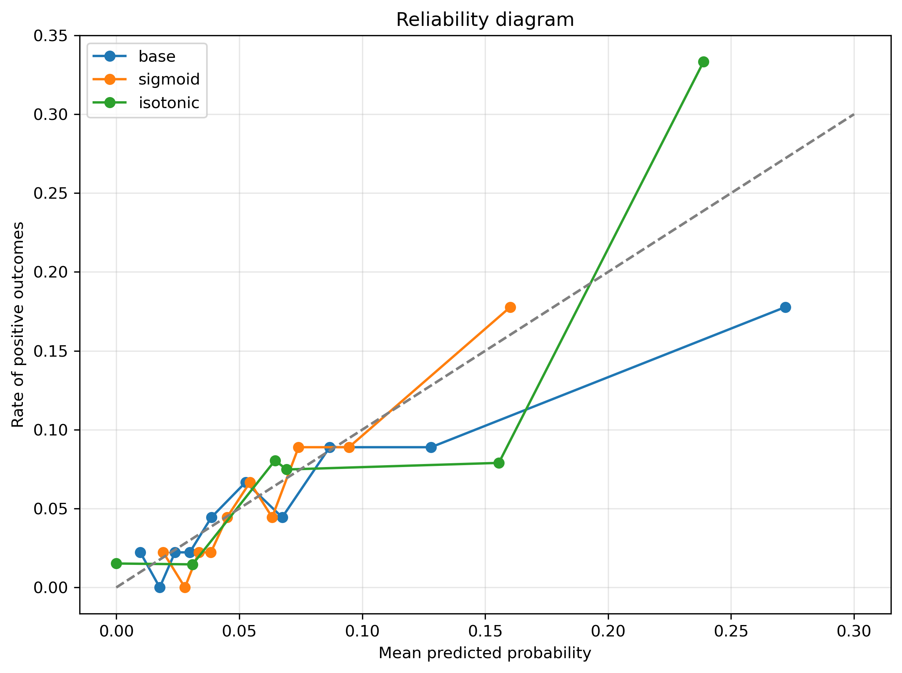

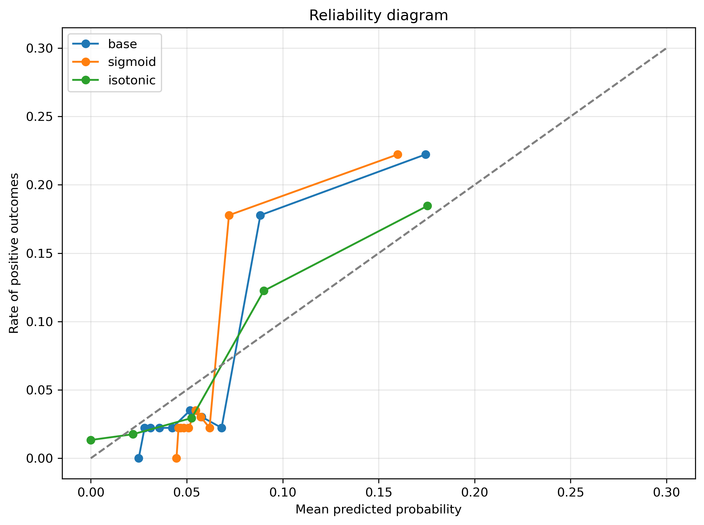

Dla obu modeli zdecydowaliśmy się wybrać kalibrację sigmoid, ponieważ:

- **Regresja logistyczna**: Kalibracja sigmoid znacząco poprawia ECE (z 0.0218 do 0.0128) przy zachowaniu AUC i minimalnym pogorszeniu innych metryk
- **Las losowy**: Kalibracja sigmoid utrzymuje doskonałe AUC (0.7832) i najlepszy Log Loss, mimo że ECE jest wyższe niż w metodzie isotonic; kalibracja izotoniczna znacząco pogarsza Log Loss (0.2619 vs 0.2007)

---

## Dobór optymalnego progu decyzyjnego

Po kalibracji modeli należało dobrać optymalny próg klasyfikacji, który minimalizuje funkcję kosztu biznesowego. Przyjęliśmy uproszczony model, definiując następującą macierz kosztów:

- **True Positive (TP)**: 0 zł - poprawnie odrzucony wniosek niewypłacalnego klienta
- **False Negative (FN)**: 100 000 zł - koszt udzielenia kredytu niewypłacalnemu klientowi
- **False Positive (FP)**: 0 zł - odrzucenie wniosku wypłacalnego klienta
- **True Negative (TN)**: -10 000 zł - zysk z udzielenia kredytu wypłacalnemu klientowi

Dla każdego modelu przeskanowaliśmy próg w zakresie [0, 1] i wybraliśmy wartość minimalizującą całkowity koszt.

### Wyniki optymalizacji progu

| Model | Optymalny próg | TP | FP | FN | TN | Stopa akceptacji |
|-------|----------------|----|----|----|----|------------------|
| Regresja logistyczna | 0.1250 | 14 | 51 | 39 | 796 | 92.78% |
| Las losowy | 0.0650 | 30 | 145 | 23 | 702 | 80.56% |

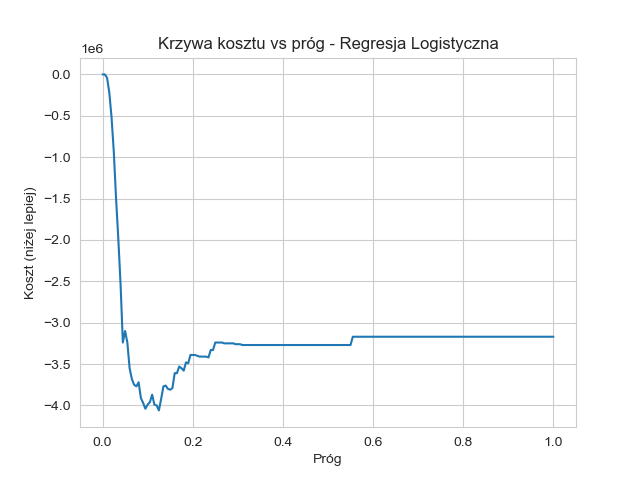

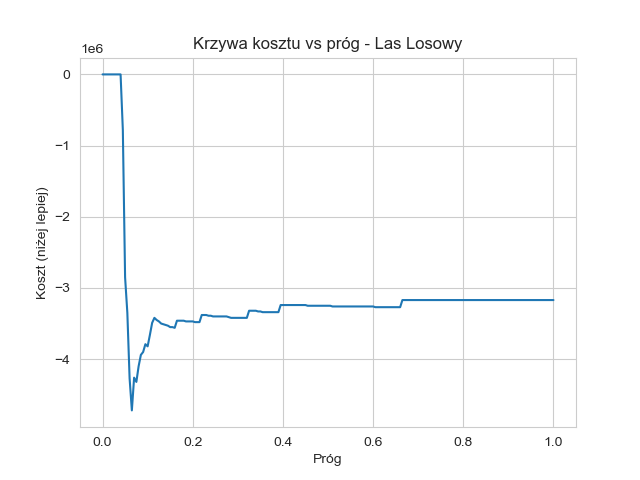

### Analiza wyników

- **Regresja logistyczna** wybiera wyższy próg (0.1250), co prowadzi do bardziej konserwatywnej strategii z wyższą stopą akceptacji (92.78%). Model akceptuje więcej klientów, ale przy tym generuje więcej błędów FN (39 przypadków nieuchwyconych defaultów).

- **Las losowy** wybiera niższy próg (0.0650), co skutkuje bardziej restrykcyjną polityką kredytową ze stopą akceptacji 80.56%. Model jest bardziej ostrożny, łapiąc więcej rzeczywistych defaultów (30 TP vs 14 dla LR), ale odrzucając przy tym więcej dobrych klientów (145 FP vs 51 dla LR).

### Macierze pomyłek z optymalnymi progami

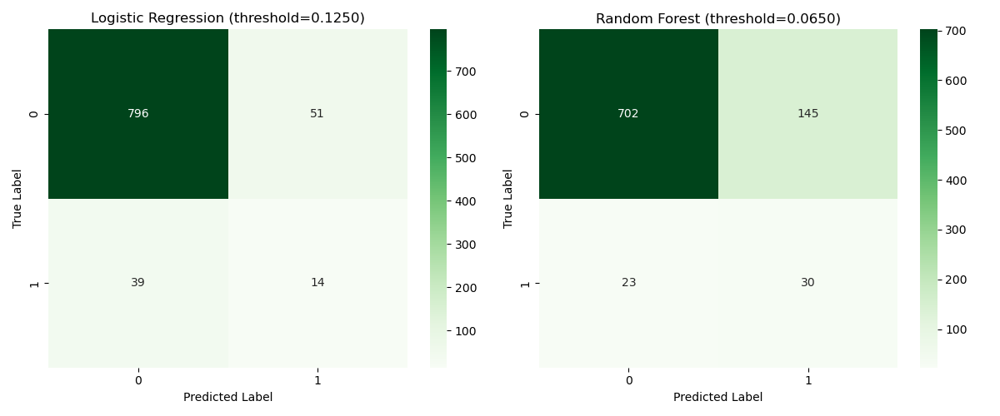

---

## Wyjaśnialność modeli

W celu lepszego wyjaśnienia działania modeli, narysowaliśmy wykresy SHAP dla obu modeli, zarówno globalne (mean absolute SHAP i beeswarm), jak i lokalne (waterfall dla kilku przykładowych obserwacji).

### Wyjaśnienia globalne dla regresji logistycznej

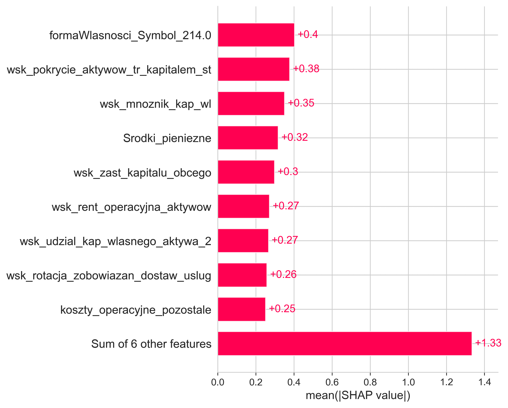
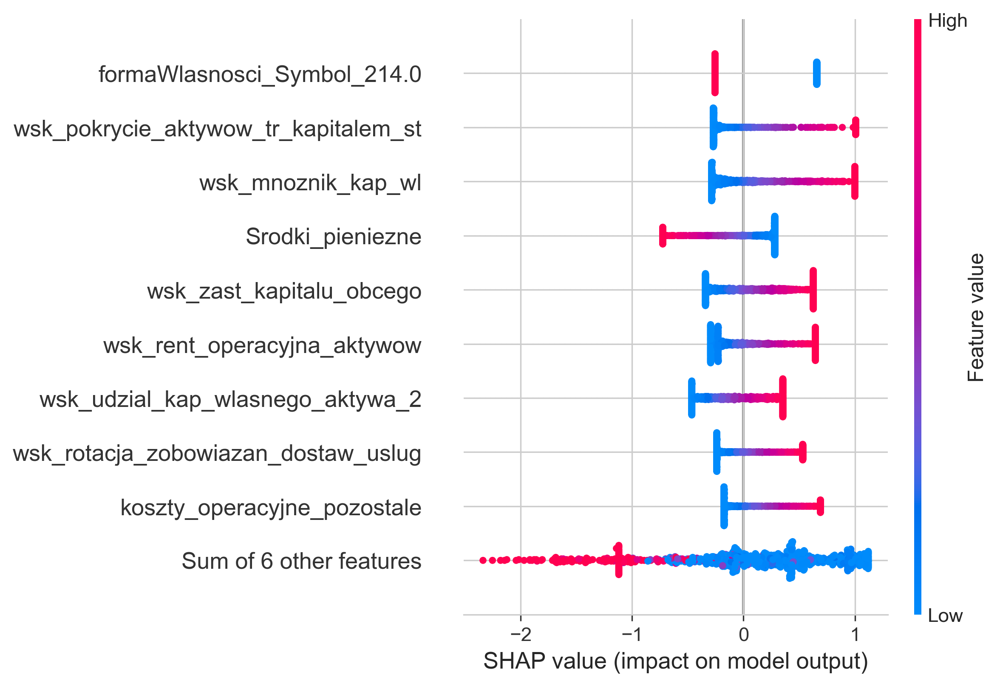

### Wyjaśnienia globalne dla lasu losowego

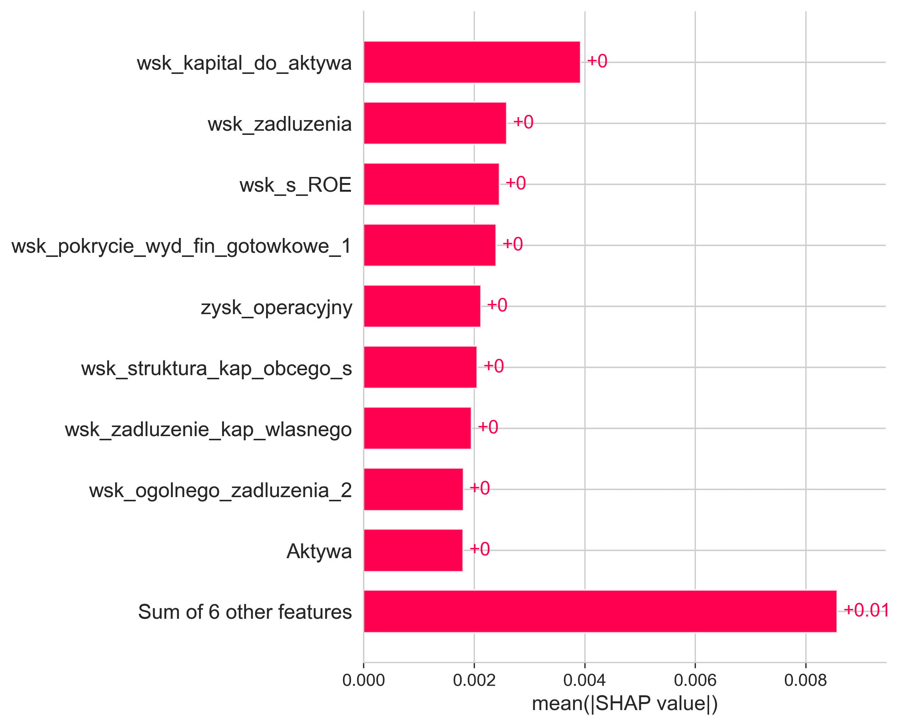
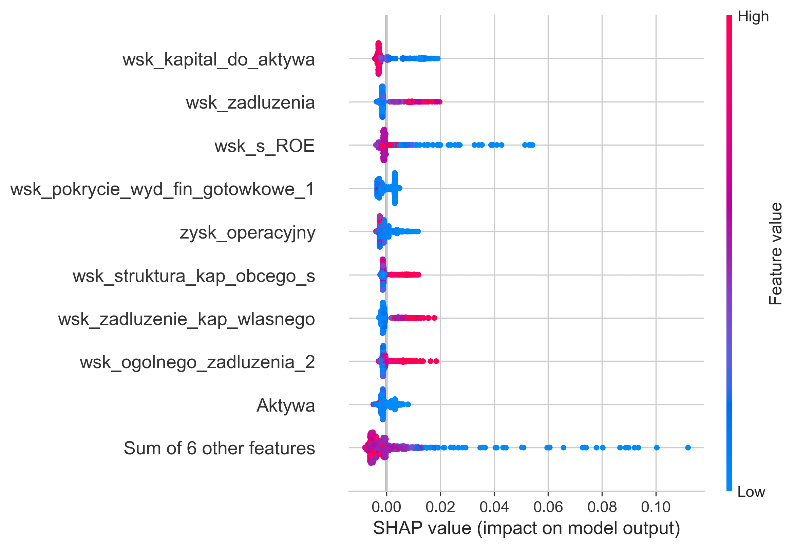

### Przykładowe wyjaśnienia lokalne

...

## Dostosowanie progu decyzyjnego

Ostatnim etapem tworzenia modelu było dostosowanie

## Mapowanie PD na ratingi

## Wnioski
